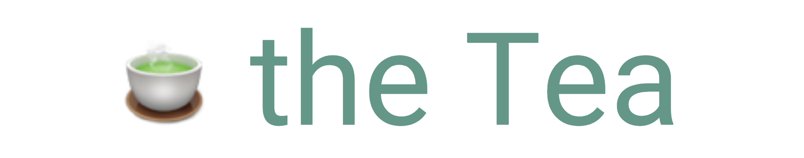
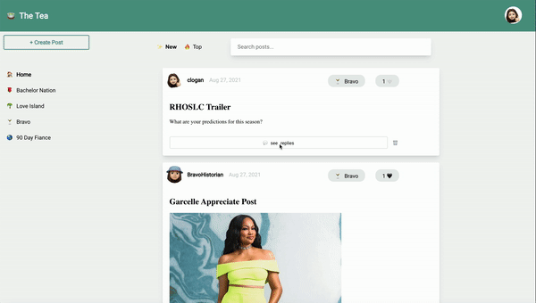

## About This Project
<p align="center"></p>


The Tea is a social media site where lovers of reality TV shows can engage in discussion and connect with other fans. Note this is the backend server of the project. Please see the frontend repository [here](https://github.com/clogan1/the-tea-frontend).

<br />

## Contributor
**Claire Logan**
<br />
github: [clogan1](https://github.com/clogan1)
<br />
email: clairelogan16@gmail.com


<br />

## Built With
This project was built with the following:
- Ruby
- ActiveRecord
- Sinatra
- [React](https://reactjs.org/)

<br />

## Getting Started
In order to set up this project locally, you will need to install and launch the backend server. To start the server, use the following in CLI:

1.  ```bundle install```
2. ```bundle exec rake server```

<br />


## Usage
On the Tea, users can create new posts, reply to existing posts, and like posts, similar to Reddit.




<br />

### User Stories
- See the 25 most recent post (at the end of window, option to "See More" to show next 25 posts)
- Filter posts by community
- Sort posts by most recent or most popular (by count of likes)
- Like a post
- Reply to a post
- Create a new post
- Delete a previous posts (only if that user created the post)

<br />

### Future Opportunities for Enhancement
- Create log in/out experience
- Add more communities
- Create more sophisticated pagination and search/sort functionality
- Add ability to edit posts/replies